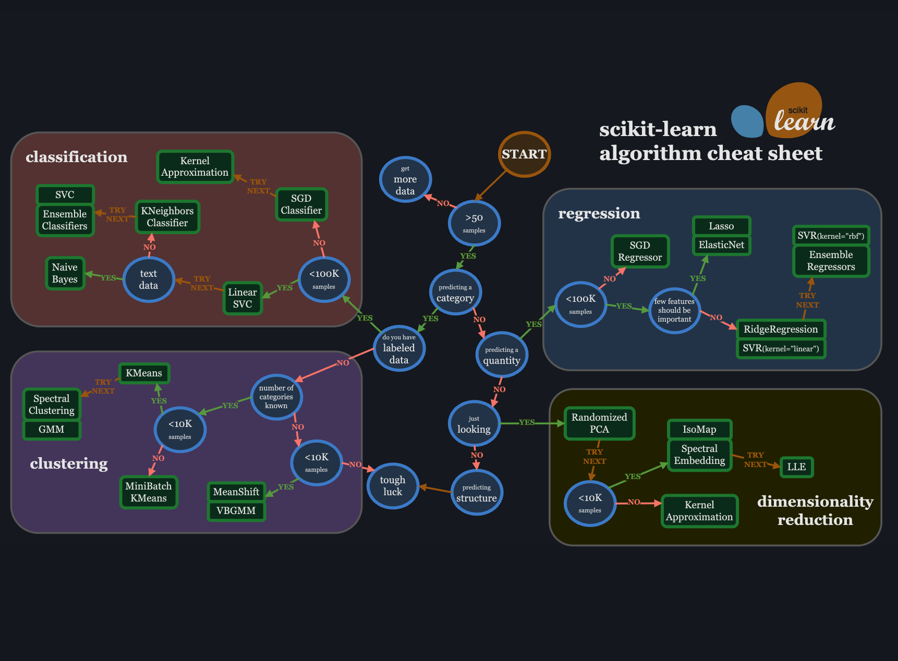

# Artificial Intelligence Notes

- **AI**: Broad field focused on building intelligent systems.
- **ML**: Enables systems to learn from data.
  - Supervised Learning
    - Regression (e.g., Linear Regression)
    - Classification (e.g., Decision Trees, SVM, KNN)
  - Unsupervised Learning
    - Clustering (e.g., K-Means, DBSCAN)
    - Anomaly Detection
    - Dimensionality Reduction (e.g., PCA, t-SNE)
  - Semi-supervised Learning
  - Reinforcement Learning
    - Q-Learning
    - Deep Q Networks (DQN)
    - Policy Gradients
- **DL**: Advanced ML using neural networks.
  - Neural Networks
  - Convolutional Neural Networks (CNNs)
  - Recurrent Neural Networks (RNNs) / LSTMs / GRUs
  - Transformers
- **NLP**: Enables machines to understand human language.
  - Text Classification
  - Sentiment Analysis
  - Named Entity Recognition (NER)
  - Machine Translation
  - Chatbots & Virtual Assistants
- **Computer Vision**: Deals with image and video data.
  - Image Classification
  - Object Detection (e.g., YOLO, SSD)
  - Image Segmentation (e.g., U-Net, Mask R-CNN)
  - Facial Recognition
  - Optical Character Recognition (OCR)
- **Expert Systems**: Rule-based AI systems for decision-making.
  - Rule-Based Systems
  - Knowledge Representation & Inference Engines
- **Generative AI (GenAI)**
  - Text Generation
  - Image Generation (e.g., DALL·E, Midjourney)
  - Audio/Voice Generation
  - Video Generation
- **Large Language Models (LLMs)**
  - GPT (OpenAI)
  - BERT (Google)
  - Claude, Gemini, LLaMA, PaLM
  - Applications: Summarization, Code Generation, Chatbots
- **Prompt Engineering**
  - Zero-shot / Few-shot Prompting
  - Chain-of-Thought Prompting
  - System vs. User Prompts
  - Prompt Tuning & Optimization

## Common Notations

**Training set** - dataset used to train model.

**Input/Feature/Input-feature** - represented by 'x'.

**Output/Target** - represented by 'y'.

**Prediction** - represented as 'y-hat' or $\hat{y}$. It is the estimated value of target.

**Model** - the function or the hypothesis generated by learning algorithm. Represented by 'f'.

**Training example** - represented as '(x,y)'.

ith training example = (xi,yi) where i denotes the number of row in the dataset.

Total number of training examples - represented by 'm'.

**Parameters or Hyperparameters** - the memories and knowledge the machine learned from model training. Defines skill of a model in solving a problem.

**Features** are the values that a supervised model uses to predict the label.  
The **label** is the "answer," or the value we want the model to predict.

## Supervised Machine Learning

Supervised learning maps input x to output y, where the learning algorithm learns from the given right answers.

Input 'x' --> Output label 'y'
Learns from being given the "right answers".

Applications: Spam filtering, speech recognition, machine translation, online advertising, self driving car, visual inspection. (most real world)

The two major types of supervised learning our regression and classification.

### Regression

Predicts a number from infinitely many possible output numbers.

Example: Housing price prediction.

#### Linear Regression

Fitting a straight line to your data.

**Univariate Linear Regression** - Linear regression with one single feature/variable 'x'.

### Classification

Predicts class or category for given inputs.
Small number of possible outputs.

Example: Breast cancer application.

## Unsupervised Machine Learning

Given data which is not associated with any output label 'y'. Find something interesting in 'unlabeled' data.

Types: Clustering, Anomaly Detection, Dimensionality Reduction.

### Clustering

Groups similar data points together.

Application: Google news, DNA microarray, Grouping customers.

### Anomaly Detection

Finds unsual data points.

### Dimensionality Reduction

Compress data using fewer numbers.

## Deep Learning

### Transformers

Consists on encoder and decoder. The encoder encodes the input sequence and passes it to the decoder, which learns how to decode the representations for a relevant task.

Transformers rely heavily on a concept called self-attention. The self part of self-attention refers to the "egocentric" focus of each token in a corpus.

## Large Language Models

Large, general-purpose language models that can be pre-trained and then fine-tuned for specific purposes. Single model can be used for different tasks. Requires minimal field training data when you tailor it for specific problems.

Large: Huge amount of training data, and huge number of parameters.

These models work by estimating the probability of a token or sequence of tokens occurring within a longer sequence of tokens. Based on tranformer models.

In-context learning - a large language model learns to accomplish a task after seeing only a few examples — despite the fact that it wasn’t trained for that task.

Applications: text classification, question answering, document summarization, language translation, sentence completion, etc.

Generative language Models - GPT(Generatively Pretrained Transformer), Gemini (Google's multimodal AI model), LaMDA (Language Model for Dialog Applications), etc.

Three types - generic language models, instruction-tuned models and dialog-tuned models.

**Generic language models** predict the next word based on the language in the training data.

**Instruction-tuned models** is trained to predict a response to the instructions given in the input.

**Dialog-tuned models** are a special case of instruction tuned where requests are typically framed as questions to a chat bot. Dialog-tuning is expected to be in the context of a longer back-and-forth conversation, and typically works better with natural, question-like phrasings.

## Prompt Engineering

Art of asking the right question to get the best output from an LLM. It enables direct interaction with the LLM using only plain language prompts.

**Prompt design** - process of creating a prompt that is tailored to the specific task that the system is being asked to perform. For example, if the system is being asked to translate a text from English to French, the prompt should be written in English and should specify that the translation should be in French.

**Prompt engineering** - process of creating a prompt that is designed to improve performance. This may involve using domain-specific knowledge, providing examples of desired output, or using keywords that are known to be effective for the specific system.

Prompt design is essential, while prompt engineering is only necessary for systems that require a high degree of accuracy or performance.

**Direct prompting** (also known as Zero-shot) is the simplest type of prompt. It provides no examples to the model, just the instruction.

**One-shot prompting** shows the model one clear, descriptive example of what you'd like it to imitate.

**Few- and multi-shot prompting** shows the model more examples of what you want it to do.

**Chain of thought prompting** - encourages the LLM to explain its reasoning. Observation that models are better at getting the right answer when they first output text that explains the reason for the answer.

## Generative AI

Type of AI that can produce new content such as text, audio, images, and synthetic data.
